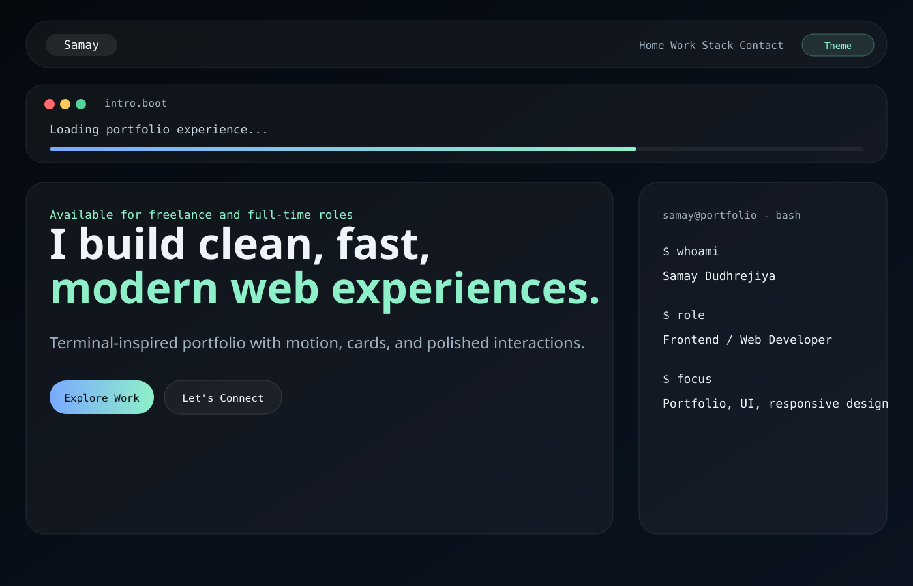
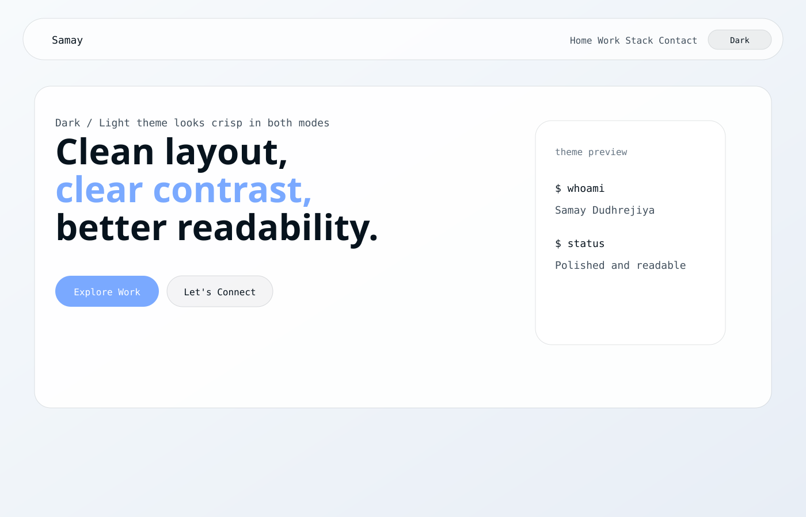

# Samay Dudhrejiya - Developer Portfolio

A modern, high-performance personal portfolio with a terminal-inspired UI, designed to showcase projects, skills, and creativity in an interactive way.

## Live Demo

View Portfolio: [https://samay-dev-portfolio.vercel.app/](https://samay-dev-portfolio.vercel.app/)

## Features

- Dark / Light Mode Toggle
- Animated Particle Background
- Scroll Progress Indicator
- Smooth Scroll Reveal Animations
- Parallax Motion Effects
- Interactive Project Cards
- Expandable Project Section ("Show More")
- Code City Simulation advanced project visualization
- Fast and Optimized Performance with Vite

## Tech Stack

- Frontend: HTML, CSS, TypeScript
- Build Tool: Vite
- Design: Custom UI with a terminal-inspired theme

## Featured Projects

Projects showcased in the portfolio:

- Personal AI Assistant
- Media Downloader Extension
- Game Store
- DevDock
- AirTouch
- DontTrust
- VisionText-AI
- Cookie-Sync
- Fun-Game
- SAMAY-PORTFOLIO
- CodeGuard OS
- RepoGalaxy
- PDFShield Pro
- Samay-dev-portfolio
- Samay.github.io
- SAMAY
- 1SAMAY

## Code City Simulation

The portfolio includes an advanced local-only mode called **Code City Simulation v2.0**, built as a Three.js Git City / GitHub Skyline-style repository map.

Open the portfolio and click **Enter Code City** or the **Code City** nav item. The city is generated from local portfolio project data:

- Project = city
- Folder = district
- File = building
- Imports/API/database/security/deployment relationships = flat roads and dependency paths
- Lines of code = building height
- Language/type = subtle building material color
- Security/performance/maintainability = HUD and score signals
- File role = procedural architecture style, such as entry tower, UI tower, backend tower, data vault, lab block, warehouse, library, deployment block, control block, or security tower
- LOC and file size create grounded vertical buildings using X/Z for city placement and Y for height

### Controls

- Mouse drag: orbit/pan the isometric city camera
- Mouse wheel: zoom
- Hover building: show file tooltip and highlight related paths
- Click building: open file detail modal
- Double-click building: focus camera on that building
- Reset Camera: return to the default skyline framing
- Fullscreen: opens the city, HUD, and right repo panel without the normal page UI
- Right panel: search, filter, sort, and switch repositories
- `Esc`: close modal or exit fullscreen

### Performance Modes

- Ultra: highest pixel ratio, shadows, and most instanced windows
- High: sharp desktop rendering with shadows and reduced window count
- Balanced: default laptop-friendly rendering
- Low: low pixel ratio, no shadows, no instanced windows, fallback list remains available

### Editing City Data

Project data starts in `src/main.ts` in the `projects` array. Code City converts that list into local city data in `src/codeCityData.ts`.

To customize buildings, scores, folders, file roles, or future parser output, edit:

- `src/codeCityData.ts` for the city data model and mapping rules
- `src/codeCity.ts` for the Three.js renderer, layout engine, camera, picking, fullscreen, and repo panel
- `styles.css` for the WebGL city shell, right sidebar, fullscreen mode, modal, and responsive fallback

No cloud API, paid API, online scanner, external AI API, or GitHub API is required for Code City.

## Getting Started

Clone the repository:

```bash
git clone https://github.com/1SAMAY/Samay-dev-portfolio.git
cd Samay-dev-portfolio
```

Install dependencies:

```bash
npm install
```

Run the development server:

```bash
npm run dev
```

Build for production:

```bash
npm run build
```

## Preview

Add screenshots or GIFs here to make your README more attractive.

### Screenshots





## License

This project is open-source and available under the MIT License.

## Support

If you like this project, consider giving it a star on GitHub. It really helps!
